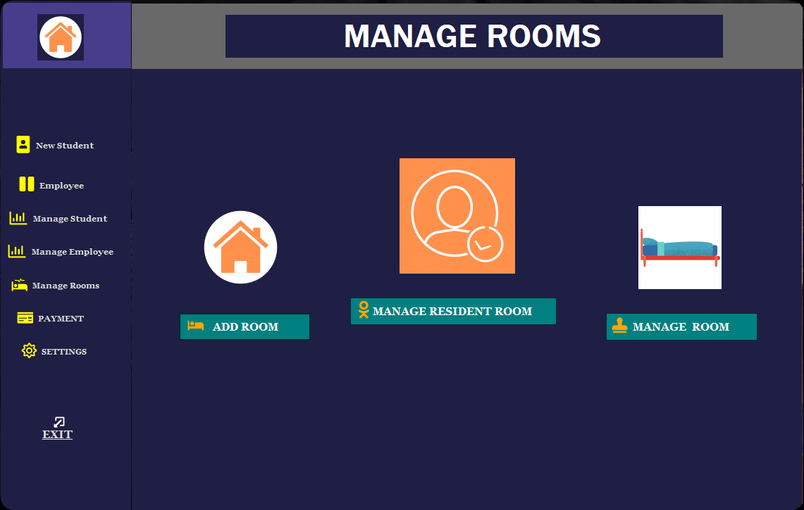
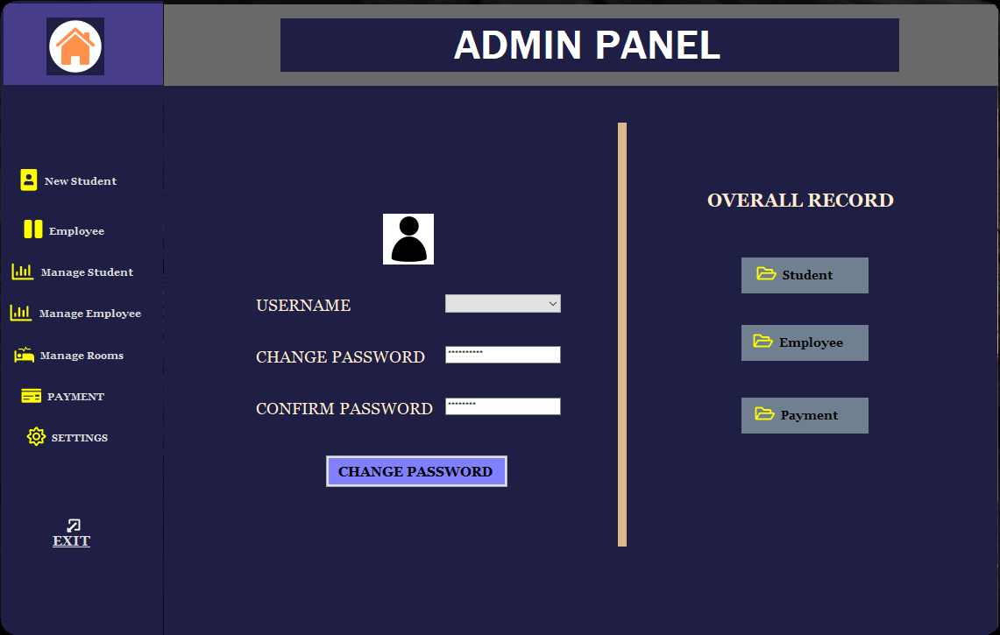

# Hostel Management System

Overview

A minor project made for institute for an offline system to manage the allocation and deallocation of rooms for students and employees of an institute.   
Features
<ul>
<li>ADMIN only</li>
<li>Login Screen</li>
<li>[Add/Remove/Edit] student or employee details</li>
<li>Manage Rooms</li>
<li>Update payment for a room</li>
<li>Check overall records</li>
</ul>

  
Requirements

<ul>
<li>.NET Technology</li>
<li>Microsoft SQL Server</li>
<li>Visual Studio</li>
</ul>

  
Screenshots

